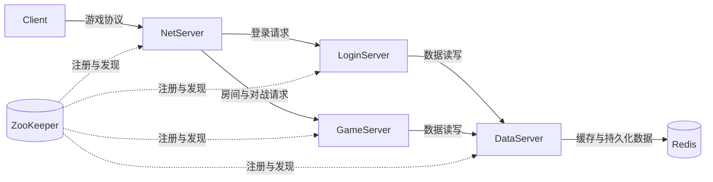

# AB 对战（ZooKeeper 版）

这是一个使用 C 语言实现的 TCP 对战游戏服务拆分示例。原来的 LogicServer 被拆分为 LoginServer 和 GameServer，所有业务数据与缓存统一由 DataServer 管理；ZooKeeper 负责服务注册、服务发现、下游依赖配置和故障感知。

## 整体架构



| 服务 | 主要职责 | ZooKeeper 中配置的下游 |
| --- | --- | --- |
| NetServer | 接收客户端连接，根据消息类型转发到登录或游戏服务 | `loginserver,gameserver` |
| LoginServer | 登录、注册以及登录相关校验 | `dataserver` |
| GameServer | 房间、匹配和对战业务 | `dataserver` |
| DataServer | 集中管理玩家、房间、战绩等数据，并访问 Redis | 无 |
| Client | 只连接 NetServer，不直接访问内部服务 | 无 |

## ZooKeeper 在本项目中的作用

### 1. 服务注册

每个服务完成监听端口和必要初始化以后，调用 `zk_service_mark_ready()`。注册线程随后在下面的位置创建临时顺序节点：

```text
/ab-game/registry/<service-name>/instance-0000000000
```

节点值是服务的连接地址，例如 `127.0.0.1:8890`。使用 `EPHEMERAL | SEQUENCE` 主要目的：

- 服务异常退出或 ZooKeeper 会话失效后，临时节点会自动消失，其他服务不会继续把它当作可用实例。
- 同一种服务可以注册多个实例，顺序编号保证每个实例节点名称唯一。
- 服务没有真正准备好之前不会注册，避免请求被路由到尚未监听或尚未连接 DataServer 的进程。

### 2. 下游依赖配置

每个服务需要访问哪些下游，保存在：

```text
/ab-game/config/<service-name>/downstreams
```

本项目默认配置为：

```text
/ab-game/config/netserver/downstreams   = loginserver,gameserver
/ab-game/config/loginserver/downstreams = dataserver
/ab-game/config/gameserver/downstreams  = dataserver
/ab-game/config/dataserver/downstreams  =
```

`zk_downstream_manager_thread` 会读取并监听当前服务的配置节点。配置变化后，watcher 唤醒管理线程，线程重新读取下游列表。代码中的默认值只在节点首次创建时写入，不会覆盖 ZooKeeper 中已经存在的配置。

### 3. 启动依赖检查

服务通过 `zk_wait_required_downstreams(timeout)` 检查所有必需下游是否至少存在一个已注册实例：

- DataServer 没有内部服务下游，只需要连接 ZooKeeper 并完成 Redis 与网络初始化。
- LoginServer 和 GameServer 必须等到 DataServer 可用。
- NetServer 必须等到 LoginServer 和 GameServer 都可用。

这样可以防止上游服务在依赖完全不可用时继续启动并接收流量。不过，这只是启动阶段的就绪检查；运行过程中仍然需要重连和错误返回机制。

### 4. 服务发现与连接选择

`zk_connect_service(service_name)` 会读取该服务在 `registry` 下的全部实例地址，从轮询位置开始逐个尝试 TCP 连接，并返回第一个可以连接的 socket。因此调用方不需要把 LoginServer、GameServer 或 DataServer 的端口写死在连接逻辑里。

当某个实例下线时，其临时节点消失；注册目录上的 watcher 会通知使用方刷新服务列表。新建或重建连接时，再次调用 `zk_connect_service()` 就能选择仍然存活的实例。

> ZooKeeper 只告诉程序“有哪些实例”。它不会自动把一条已经断开的 TCP 连接迁移到新实例；NetServer、LoginServer 和 GameServer 的重连线程仍必须检测断线、关闭旧 fd，并重新调用服务发现接口。

### 5. ZooKeeper 会话恢复

`zk_connection_thread` 负责初始化 ZooKeeper 客户端并监控会话。会话过期时，它会关闭旧句柄、清除旧注册路径并重新连接。服务仍处于 ready 状态时，注册线程会在新会话建立后重新创建临时实例节点。

## ZooKeeper 节点结构

```text
/ab-game
├── config
│   ├── netserver/downstreams
│   ├── loginserver/downstreams
│   ├── gameserver/downstreams
│   └── dataserver/downstreams
└── registry
    ├── netserver/instance-*
    ├── loginserver/instance-*
    ├── gameserver/instance-*
    └── dataserver/instance-*
```

## 服务启动流程

单个服务的流程是：

1. 调用 `zk_service_start()`，保存服务名、监听地址、端口和默认下游配置。
2. 启动 ZooKeeper 连接线程。
3. 启动 ZooKeeper 下游配置管理线程。
4. 建立 ZooKeeper 会话，创建项目所需的 config 和 registry 节点。
5. 调用 `zk_wait_required_downstreams()`，等待下游实例可用。
6. 执行 Redis、任务队列、工作线程、TCP 监听和下游 TCP 连接等业务初始化。
7. 业务服务确认可以接收请求后调用 `zk_service_mark_ready()`。
8. 启动注册线程，创建本服务的临时顺序实例节点。

推荐的整体启动顺序：

```text
ZooKeeper + Redis
        ↓
DataServer
        ↓
LoginServer + GameServer
        ↓
NetServer
        ↓
Client
```

## ZooKeeper 不负责什么

- 不保存玩家、房间或战绩缓存；这些状态属于 DataServer/Redis。
- 不转发客户端游戏协议；所有客户端流量仍然经过 NetServer。
- 不替代 TCP 重连、请求超时、失败重试和幂等处理。
- 不保证房间一致性，也不保存 GameServer 的业务状态。
- 不替代负载均衡器；当前代码只在服务发现后使用轮询起点并尝试可连接实例。

因此，本项目里的 ZooKeeper 可以概括为：**管理服务在哪里、依赖谁、是否还活着；业务数据和游戏逻辑仍由各自服务负责。**
