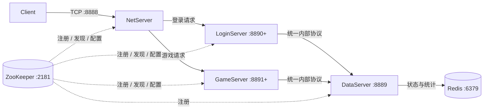
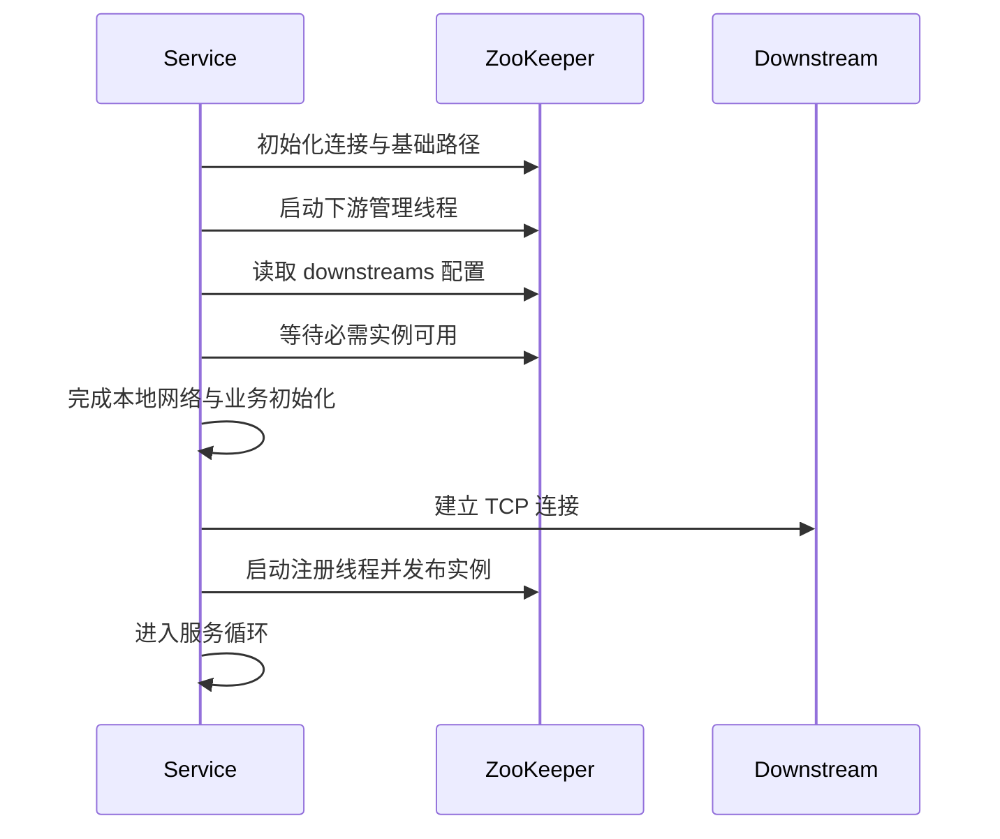

# AB 对战（ZooKeeper 版）

> 一个用 C 实现的分层 TCP 游戏服务示例：将登录与游戏逻辑拆分，由 ZooKeeper 管理服务发现和启动依赖，由 DataServer 统一持有业务状态并通过 Redis 持久化。

## Portfolio Summary

AB Fight is a Linux C backend project that evolves a monolithic game logic service into LoginServer and GameServer. NetServer routes requests, ZooKeeper provides service registration and discovery, and DataServer remains the single owner of game state and Redis-backed data. The project focuses on service boundaries, protocol consistency, reconnect behavior, concurrency, and failure-aware startup.

## 项目展示的工程能力

- **服务拆分**：登录和游戏业务分别进入 LoginServer、GameServer，避免继续堆积在单一 LogicServer 中。
- **统一数据所有权**：LoginServer 与 GameServer 不保存业务缓存，房间、玩家状态和统计数据统一由 DataServer 管理。
- **服务治理**：使用 ZooKeeper 完成实例注册、下游配置、服务发现、启动依赖检查和会话恢复。
- **网络与并发**：NetServer 维护客户端连接并转发请求，DataServer 使用 `epoll`、任务队列和工作线程处理并发。
- **故障边界意识**：区分“发现新实例”“重建 TCP 连接”和“重放业务请求”，避免把 ZooKeeper 误解为自动容错代理。

## 系统架构



### 数据流与职责

| 组件 | 主要职责 | 下游依赖 |
| --- | --- | --- |
| `client.c` | 读取命令、发送请求、展示结果 | NetServer |
| `netserver.c` | 接入客户端，按消息类型路由登录或游戏请求 | LoginServer、GameServer |
| `loginserver.c` | 处理登录相关逻辑，不保留玩家业务缓存 | DataServer |
| `gameserver.c` | 处理房间、对战、统计等游戏逻辑，不保留房间缓存 | DataServer |
| `dataserver.c` | 业务状态唯一所有者；处理房间、对战、排行榜、称号等数据 | Redis |
| `zookeeper.c/.h` | 注册、发现、下游配置、启动等待与会话恢复 | ZooKeeper |

## 功能范围

- 玩家登录与会话识别；
- 创建房间、查询房间、加入/离开房间；
- 两名玩家进入准备和对战流程并提交数字；
- 房间状态与超时处理；
- 对局统计、排行榜、称号和兑换逻辑；
- 服务实例启动、退出后的发现与连接重建。

> 本项目使用文本消息演示完整链路，适合学习服务拆分和故障处理，不应直接视为生产级游戏后端。

## ZooKeeper 在本项目中的作用

### 1. 服务注册

服务启动后在以下路径创建临时顺序节点：

```text
/ab-game/registry/<service>/instance-*
```

节点内容为服务地址 `host:port`。临时节点与 ZooKeeper 会话绑定，进程退出或会话失效后会被删除，使其他服务能够感知实例变化。

### 2. 下游依赖配置

每个服务需要访问哪些下游服务，由以下节点描述：

```text
/ab-game/config/<service>/downstreams
```

当前依赖关系为：

| 服务 | 配置的下游 |
| --- | --- |
| NetServer | LoginServer、GameServer |
| LoginServer | DataServer |
| GameServer | DataServer |
| DataServer | 无 |

这让启动依赖从散落在业务代码中的假设，变成可以集中查看和维护的配置。

### 3. 启动依赖检查

服务启动 ZooKeeper 下游管理线程后，通过 `zk_wait_required_downstreams()` 等待必需的下游实例可用。这样可以减少“监听端口已经打开，但依赖尚未准备好”的半初始化状态。

### 4. 服务发现与连接建立

上游通过 `zk_connect_service()` 查询可用实例，再建立真正的 TCP 连接。ZooKeeper 只提供地址和变化信息，业务数据仍然通过 TCP 传输。

### 5. 会话恢复与重新注册

ZooKeeper 会话重新建立后，服务需要恢复自己的临时注册节点，并重新加载下游信息。服务发现可以帮助找到替代实例，但不会自动迁移已有 socket，也不会保证正在处理的请求被重放。

### ZNode 结构

```text
/ab-game
├── config
│   ├── netserver/downstreams
│   ├── loginserver/downstreams
│   ├── gameserver/downstreams
│   └── dataserver/downstreams
└── registry
    ├── netserver/instance-*
    ├── loginserver/instance-*
    ├── gameserver/instance-*
    └── dataserver/instance-*
```

## 服务启动流程



对应的设计顺序是：初始化 ZooKeeper → 启动下游管理 → 等待依赖 → 完成其他初始化 → 建立下游连接 → 注册本服务。

## 环境依赖

以下以 Ubuntu/Debian 为例，具体包名可能随发行版变化：

```bash
sudo apt update
sudo apt install build-essential libzookeeper-mt-dev libhiredis-dev redis-server zookeeperd
```

默认地址和端口：

| 服务 | 默认地址 |
| --- | --- |
| ZooKeeper | `127.0.0.1:2181` |
| Redis | `127.0.0.1:6379` |
| DataServer | `127.0.0.1:8889` |
| LoginServer | `127.0.0.1:8890` |
| GameServer | `127.0.0.1:8891` |
| NetServer / Client | `127.0.0.1:8888` |

## 编译

```bash
mkdir -p bin

gcc -std=c11 -D_POSIX_C_SOURCE=200809L -DTHREADED \
  -O2 -g -Wall -Wextra -pthread \
  client.c -o bin/client

gcc -std=c11 -D_POSIX_C_SOURCE=200809L -DTHREADED \
  -O2 -g -Wall -Wextra -pthread \
  netserver.c zookeeper.c -o bin/netserver -lzookeeper_mt

gcc -std=c11 -D_POSIX_C_SOURCE=200809L -DTHREADED \
  -O2 -g -Wall -Wextra -pthread \
  loginserver.c zookeeper.c -o bin/loginserver -lzookeeper_mt

gcc -std=c11 -D_POSIX_C_SOURCE=200809L -DTHREADED \
  -O2 -g -Wall -Wextra -pthread \
  gameserver.c zookeeper.c -o bin/gameserver -lzookeeper_mt

gcc -std=c11 -D_POSIX_C_SOURCE=200809L -DTHREADED \
  -O2 -g -Wall -Wextra -pthread \
  dataserver.c zookeeper.c -o bin/dataserver -lzookeeper_mt -lhiredis
```

如果出现 `undefined reference to zk_connect_service`，请确认当前 `zookeeper.h` 已声明该函数、`zookeeper.c` 已实现它，并且编译命令确实同时包含了 `zookeeper.c`。

## 运行

先确认 ZooKeeper 和 Redis 已启动，再按依赖从下游到上游运行：

```bash
./bin/dataserver
./bin/loginserver 0
./bin/gameserver 0
./bin/netserver
./bin/client
```

`loginserver` 和 `gameserver` 的可选参数可用于选择实例编号；默认实例分别从 8890 和 8891 开始映射端口。需要观察实例切换时，可以再启动 `loginserver 1`、`gameserver 1`，随后停止旧实例并查看 NetServer 的发现与重连日志。

客户端可按照提示完成以下演示路径：

```text
登录 → 查询/创建房间 → 第二个客户端加入 → 双方提交数字
     → 查看结果 → 查询战绩/排行榜/称号
```

## 故障场景与预期边界

| 场景 | 当前设计的处理方式 | 仍需注意 |
| --- | --- | --- |
| 服务尚未启动 | 上游等待 ZooKeeper 中出现必需实例 | 等待应设置合理超时和日志 |
| Login/Game 实例退出 | 临时节点消失，NetServer 重新发现并连接可用实例 | 已在途请求不会自动重放 |
| DataServer 连接断开 | Login/Game 需要重新发现并重建连接 | 重试期间应明确返回“目标服务不可用” |
| ZooKeeper 短暂断线 | 会话恢复后重新注册并刷新下游 | 超过会话超时会创建新的临时节点 |
| Redis 不可用 | DataServer 初始化或数据操作失败 | 当前仍是单点依赖 |

## 关键设计取舍

- **为什么 LogicServer 不保留缓存**：让 DataServer 成为状态唯一来源，避免登录服务、游戏服务之间出现房间或玩家数据不一致。
- **为什么仍需要内部 TCP 协议**：ZooKeeper 解决“服务在哪里”，不承载业务请求；服务间仍要定义一致的消息格式和请求响应关系。
- **为什么拆成 LoginServer 与 GameServer**：职责清晰后可以独立演进、定位故障，也为将来按业务压力扩展实例打基础。
- **为什么不承诺无感切换**：服务发现只能找到新地址。要实现严格的请求级容错，还需要请求 ID、幂等、超时、重试和状态恢复策略。

## 已知限制与下一步

- 当前协议以学习用文本消息为主，可升级为长度前缀 + Protobuf，并加入版本号。
- 默认地址、端口和 ZooKeeper 根路径写在代码配置中，可改为配置文件或环境变量。
- Redis、DataServer 和 NetServer 仍可能形成单点，需要进一步设计持久化、主从或分片策略。
- 补充自动化构建、单元测试、协议测试、断线回归和并发压力测试。
- 增加请求 ID、幂等处理、发送背压、指标监控和结构化日志。
- 当前仓库未声明生产环境安全能力；鉴权、TLS、限流和输入校验仍需加强。

## 相关学习记录

更完整的线程、同步、TCP 与 `epoll` 学习过程见 [`linux-backend-learning-notes`](https://github.com/feiyun0310/linux-backend-learning-notes)。
