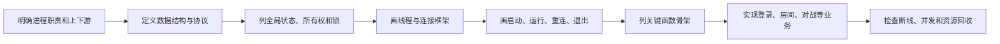
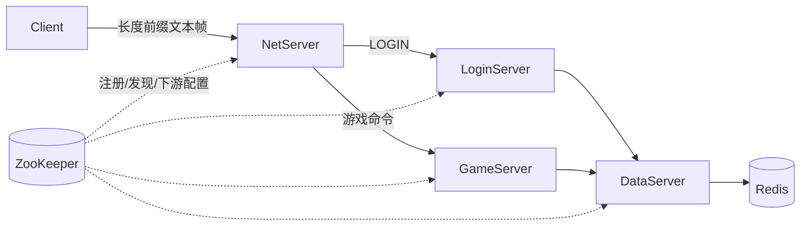
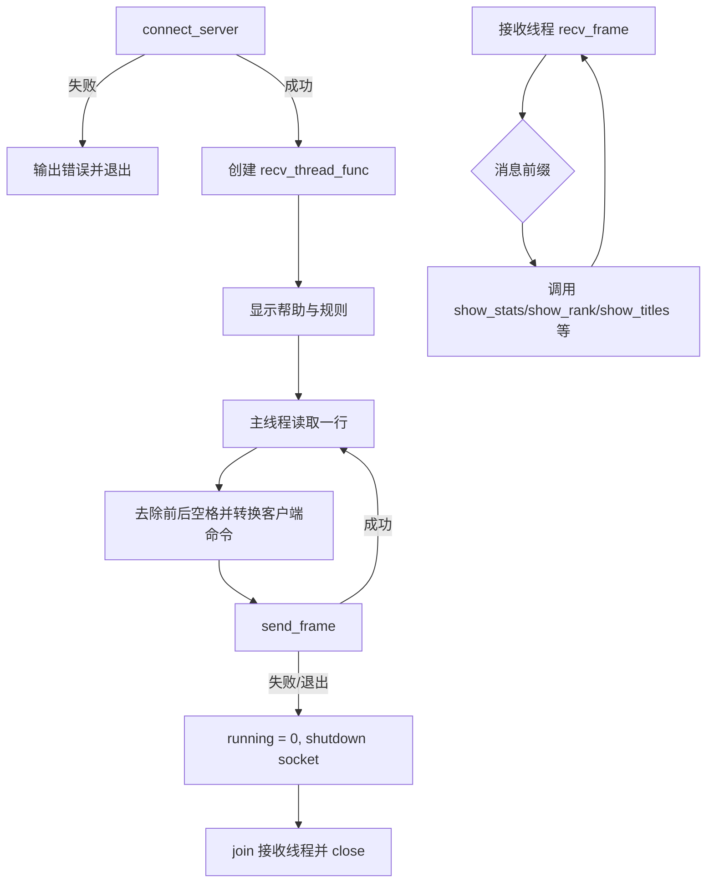
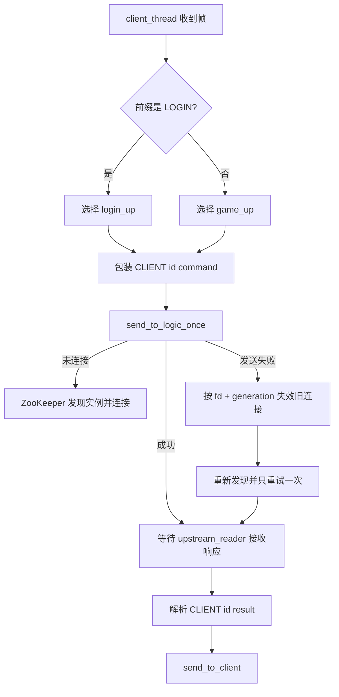
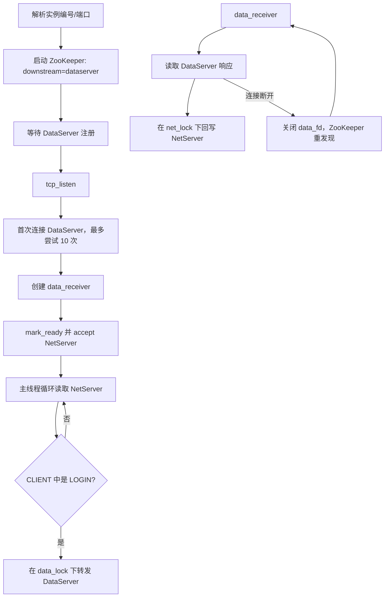
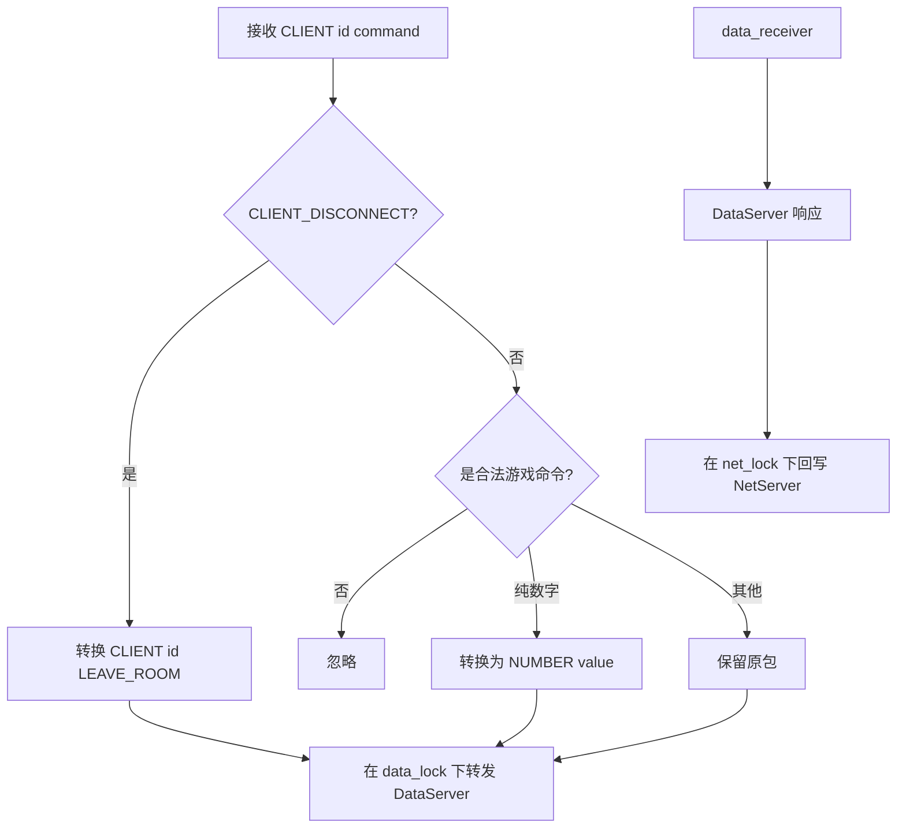
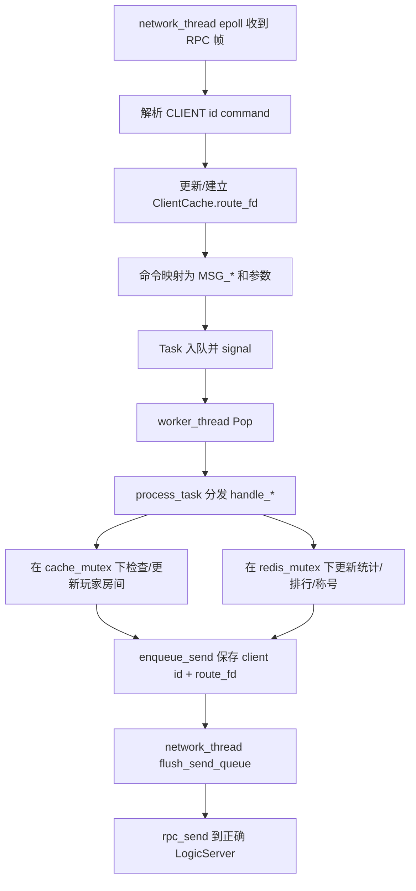
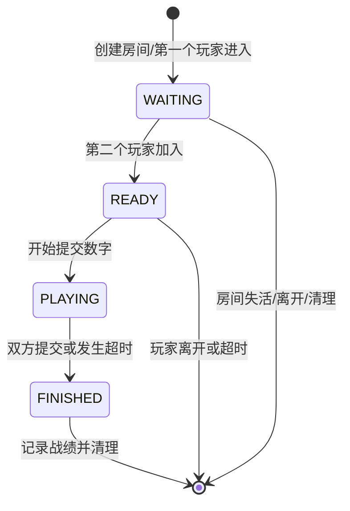
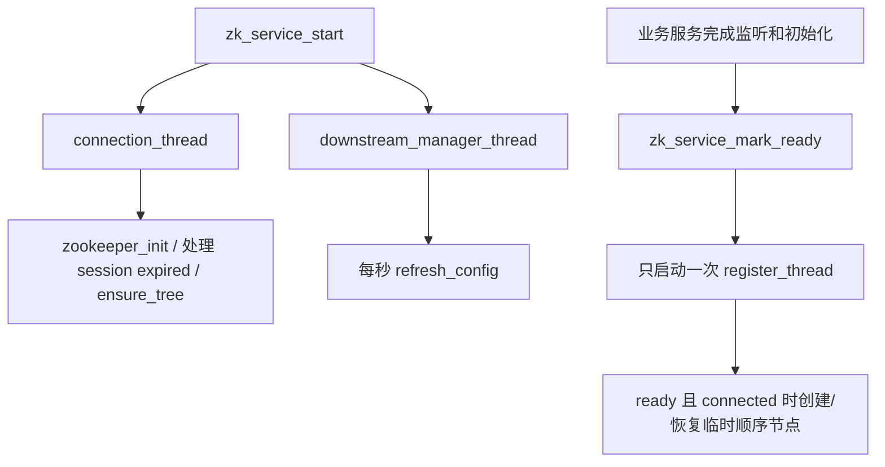
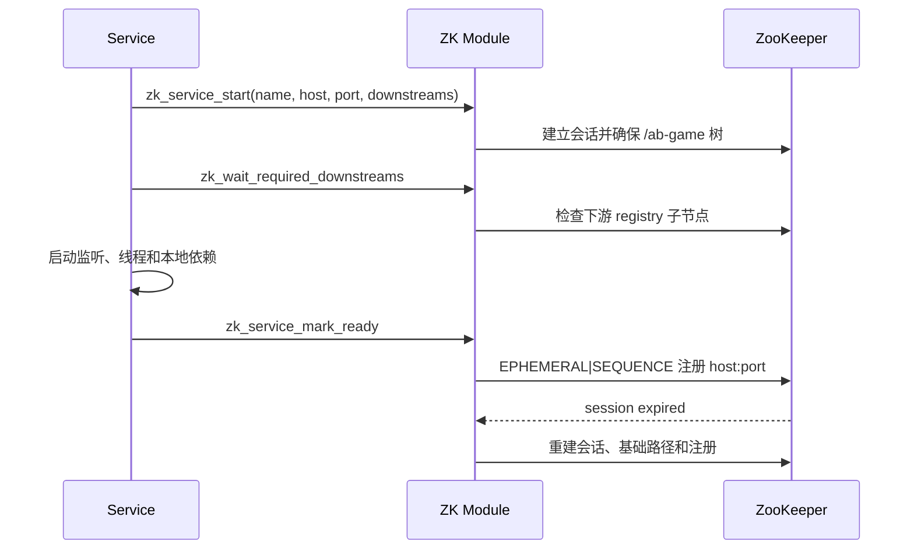

# AB 对战：按“先骨架、后业务”复盘全部程序

> 本文不是重新描述功能列表，而是按照固定程序设计方法逐个拆解 `client.c`、`netserver.c`、`loginserver.c`、`gameserver.c`、`dataserver.c` 和 `zookeeper.c/.h`：先明确职责，再看数据结构、全局状态、线程框架、生命周期、函数骨架和异常边界。内容以当前仓库源码为准。

## 1. 方法总览



## 2. 先看整个系统的数据所有权



| 数据 | 唯一或主要所有者 | 说明 |
| --- | --- | --- |
| 用户输入和界面显示 | Client | 客户端只保留连接与显示状态 |
| 客户端连接与路由 ID | NetServer | `Client` 链表保存真实 socket 和逻辑 client id |
| Login/Game 的业务状态 | 无 | 两个 Logic 服务不保存玩家或房间缓存，只转发 |
| 玩家、房间和对局状态 | DataServer | `ClientCache`、`RoomCache` 统一集中在 DataServer |
| 战绩、分数、排行榜、称号 | Redis，经 DataServer 访问 | DataServer 使用 hiredis 串行保护 Redis 连接 |
| 服务地址、下游配置和注册状态 | ZooKeeper 模块 | 临时顺序节点保存实例地址 |

这个所有权设计对应项目的重要约束：LoginServer 和 GameServer 内没有业务缓存；需要一致性的玩家与房间状态只在 DataServer 中维护。

## 3. 公共协议和基础函数先行

`zookeeper.c/.h` 同时提供了项目的公共 RPC 帧：4 字节网络字节序长度 + 文本消息体。`rpc_send`/`rpc_recv` 内部使用 `send_all`/`recv_all`，避免一次系统调用只处理部分数据。

```text
[uint32 body_length][body bytes]
body 例：CLIENT|100001|LOGIN alice
```

必须保持的不变量：消息体长度大于 0、小于调用方缓冲容量并且不超过 `RPC_MAX_BODY`；读完长度后必须精确读满消息体；收到非法长度或中途断开时关闭当前连接。

---

# 一、Client（`client.c`）

## 1. 职责和边界

Client 连接 `127.0.0.1:8888`，主线程读取命令并发送，接收线程持续读取服务端帧并按照结果类型展示登录、房间、战绩、排行、称号和兑换结果。它不直接知道 LoginServer、GameServer 或 DataServer 的地址。

## 2. 数据结构与全局状态

当前客户端没有复杂结构体，核心状态是：

| 状态 | 访问者 | 作用 |
| --- | --- | --- |
| `sock_fd` | 主线程、接收线程 | 唯一 NetServer TCP 连接 |
| `running` | 主线程、接收线程 | 控制输入循环和接收循环 |
| 局部输入/接收 buffer | 各自线程 | 线程私有，不需要共享锁 |

`running` 当前是普通 `int`。如果继续强化并发语义，可改为原子变量，或让关闭流程通过 socket shutdown 驱动接收线程退出。

## 3. 线程框架

| 线程 | 入口 | 输入 | 输出 | 退出条件 |
| --- | --- | --- | --- | --- |
| 主线程 | `main` | 标准输入 | `send_frame` | 用户退出、发送失败或 `running == 0` |
| 接收线程 | `recv_thread_func` | `recv_frame` | `show_*` 系列界面函数 | 断线或 `running == 0` |

## 4. 主流程



## 5. 关键函数骨架

- `send_all_client` / `recv_all_client`：完整发送/接收指定字节数；
- `send_frame` / `recv_frame`：处理统一长度前缀；
- `connect_server`：创建 socket 并连接 NetServer；
- `recv_thread_func`：按服务端响应前缀分发到显示函数；
- `show_help`、`show_rules`、`show_stats`、`show_rank`、`show_titles`、`show_redeem_result`：只处理显示。

## 6. 检查点

- 线程创建结果需要检查；
- `running` 的跨线程访问需要明确同步；
- 退出时应先 shutdown，使阻塞中的 `recv` 返回，再 join 和 close；
- 显示解析必须限制字段长度并容忍服务端返回错误。

---

# 二、NetServer（`netserver.c`）

## 1. 职责

NetServer 是客户端统一入口。它为每个客户端分配稳定的逻辑 ID，把 `LOGIN` 路由到 LoginServer，把其他命令路由到 GameServer，并把两个上游的响应按 `CLIENT|id|...` 送回正确客户端。

## 2. 先定义的核心结构

```c
typedef struct {
    const char *name;
    int fd;
    unsigned long generation;
    pthread_mutex_t lock;
    pthread_mutex_t connect_lock;
} Upstream;

typedef struct Client {
    int id;
    int fd;
    pthread_mutex_t write_lock;
    struct Client *next;
} Client;
```

`generation` 是很重要的连接代次：旧读取线程发现错误时，只有 fd 和 generation 都仍匹配，才能失效当前连接，避免把另一个线程刚建立的新连接误关掉。

## 3. 全局状态与锁

| 状态 | 保护方式 | 不变量 |
| --- | --- | --- |
| `login_up`、`game_up` | 各自 `lock` + `connect_lock` | 每类上游最多一个当前连接；只有一个线程执行重连 |
| `clients` 链表 | `clients_lock` | client id 唯一，节点移除后不再查到 |
| `Client.fd` | `Client.write_lock` | 同一客户端的响应帧不能交错 |
| `next_client_id` | 原子加法内建函数 | 新连接获得递增 ID |

## 4. 线程框架

| 线程 | 数量 | 职责 |
| --- | ---: | --- |
| 主线程 | 1 | 初始化 ZooKeeper、监听 8888、accept |
| `client_thread` | 每客户端 1 个 | 收客户端命令、选择上游、包装 client id |
| `upstream_reader` | 2 个 | 分别读取 Login/Game 响应并回写客户端 |
| ZooKeeper 后台线程 | 2～3 个 | 连接、刷新下游、就绪后注册 |

## 5. 路由与重连流程



客户端断开后，`client_thread` 发送 `CLIENT_DISCONNECT|id` 给 GameServer，使 DataServer 执行离开房间清理。

## 6. 关键函数骨架

- 客户端表：`add_client`、`remove_and_close_client`、`send_to_client`；
- 上游状态：`ensure_upstream_connected`、`snapshot_upstream`、`invalidate_upstream`；
- 请求路径：`send_to_logic_once`、`send_to_logic`、`client_thread`；
- 响应路径：`upstream_reader`。

## 7. 当前边界

- 每类 Logic 服务当前只保留一个活动上游 socket；ZooKeeper 多实例主要用于重新选择，而不是同时并行分发多个长连接；
- 发送失败只重试一次，没有请求 ID、幂等或确认机制，因此不能保证失败瞬间的请求一定完成；
- 客户端使用一连接一线程，规模增大后可以改为 epoll；
- `clients_lock` 内部还会取得 `write_lock` 并执行发送，后续应缩短全局锁持有时间并设计输出队列；
- 主循环和 detached 线程没有完整统一的停止/join 流程。

---

# 三、LoginServer（`loginserver.c`）

## 1. 职责与数据

LoginServer 只接受 `LOGIN` 类命令并转发给 DataServer。它没有玩家缓存，只有两个连接状态：

| 状态 | 锁 | 含义 |
| --- | --- | --- |
| `net_fd` | `net_lock` | 当前 NetServer 连接 |
| `data_fd` | `data_lock` | 当前 DataServer 连接 |

监听端口默认 8890。参数 0/1/... 被解释为实例编号并映射到 `8890 + index * 2`；大于 1000 的参数作为显式端口。

## 2. 线程框架和流程



## 3. 当前边界

当前 `net_fd` 是单个全局变量，因此一个 LoginServer 实例只为一个当前 NetServer 连接回传结果；新的 NetServer 连接会替换 `net_fd`。如果需要多个 NetServer，应改为连接表，并让 DataServer 响应携带路由目标。

---

# 四、GameServer（`gameserver.c`）

## 1. 职责与数据

GameServer 负责识别房间、对战、战绩、排行、称号和兑换命令并转发。和 LoginServer 一样，它没有房间或玩家缓存，只维护 `net_fd`、`data_fd` 及对应锁。默认端口为 8891，实例编号映射为 `8891 + index * 2`。

## 2. 命令和断线转换

`is_game_command` 允许数字、`CREATE_ROOM`、`JOIN_ROOM`、`LIST_ROOMS`、`LEAVE_ROOM`、`STATS`、`RANK`、`TITLES`、`REDEEM`。纯数字输入会转换为 `NUMBER <value>`；`CLIENT_DISCONNECT|id` 会转换为该客户端的 `LEAVE_ROOM`。



## 3. 当前边界

GameServer 和 LoginServer 的连接/重连框架基本重复，可以抽成公共代理模块。它同样只保存一个当前 `net_fd`；同时共享 `data_fd` 的收发虽然分别加锁，但请求与响应没有显式 request id，依赖 DataServer 响应中的 client id 做路由。

---

# 五、DataServer（`dataserver.c`）

## 1. 职责

DataServer 是业务状态唯一所有者：统一管理登录状态、房间状态机、玩家数字、超时、战绩、排行、称号与兑换，并访问 Redis。它也是当前项目中最需要先设计结构和线程边界的程序。

## 2. 核心数据结构

| 结构 | 关键字段 | 表达的状态 |
| --- | --- | --- |
| `RoomCache` | room_id、两个玩家、numbers、has_sent、时间、state | 一个双人房间从等待到结束的完整状态 |
| `ClientCache` | 逻辑 client id、route_fd、username、room_id、selecting、logged_in | 玩家状态及响应应返回哪条 Logic 连接 |
| `Task` | client id、msg_type、data、next | 网络线程交给工作线程的业务任务 |
| `SendItem` | client id、route_fd、data、next | 工作线程交回网络线程的待发送响应 |

`ClientCache.fd` 是 NetServer 分配的逻辑 client id，不是 DataServer socket；`route_fd` 才是当前 Login/Game 到 DataServer 的连接。这个区分避免把业务玩家身份和瞬时服务连接混在一起。

## 3. 全局状态与同步

| 状态 | 保护方式 | 所有者/访问者 |
| --- | --- | --- |
| `redis_conn` | `redis_mutex` | 四个工作线程共享 hiredis 连接 |
| `room_cache`、`client_cache`、`next_room_id` | `cache_mutex` | 工作线程和网络路由更新逻辑 |
| Task 链表 | `task_mutex` + `task_cond` | 网络线程生产，工作线程消费 |
| SendItem 链表 | `send_mutex` | 工作线程生产，网络线程 flush |
| `epoll_fd`、`server_fd` | 网络线程主要拥有 | 服务生命周期 |
| `server_running` | 网络线程、工作线程、主线程 | 当前普通 int，承担停止标记 |

## 4. 线程框架

| 线程 | 数量 | 工作 |
| --- | ---: | --- |
| 主线程 | 1 | Redis/ZooKeeper 初始化、创建和 join 线程 |
| `network_thread` | 1 | epoll accept/recv、命令解析、Task 入队、SendItem flush、超时清理 |
| `worker_thread` | 4 | Pop Task、调用 `process_task`、更新缓存和 Redis、enqueue_send |
| ZooKeeper 后台线程 | 2～3 | 连接、配置、注册 |

## 5. 网络到业务再到响应



## 6. 房间状态机



需要保持：每个玩家最多位于一个活动房间；房间最多两个玩家；每名玩家每局只提交一次数字；战绩只记录一次（`has_recorded`）；超时和主动离开都必须更新双方状态。

## 7. 函数骨架

- Redis：`init_redis`、`redis_cmd`、`record_match_to_redis`；
- 缓存：`add/remove/find_room_in_cache`、`find/add/update_client`；
- 业务：`handle_login`、`handle_create_room`、`handle_join_room`、`handle_select_room`、`handle_send_number`、`handle_leave_room`；
- 查询：`handle_list_rooms`、`handle_stats`、`handle_rank`、`handle_titles`、`handle_redeem`；
- 对局与维护：`resolve_game`、`check_timeout_rooms`、`cleanup_inactive_rooms`；
- 并发：`worker_thread`、`network_thread`、`enqueue_send`、`flush_send_queue`。

## 8. 当前边界

- 业务缓存确实全部位于 DataServer，但 DataServer 本身仍是单点内存状态；进程重启后房间与在线状态不会由 Redis 完整恢复；
- Task 和 SendItem 使用链表队列，没有容量上限和背压；
- `server_running` 不是原子变量，停止时还需要 broadcast 唤醒等待中的工作线程；
- EPOLLET 下 accept/recv 当前没有始终循环到 `EAGAIN`，高并发时应进一步完善；
- 共享单个 hiredis 连接由 mutex 串行化，吞吐增大后可使用连接池或每工作线程连接；
- 线程创建部分需要记录成功数量，避免 malloc/创建失败后 join 未初始化线程。

---

# 六、ZooKeeper 模块（`zookeeper.c/.h`）

## 1. 数据结构和全局状态

`ServiceEndpoint { host, port }` 表示一个发现结果。模块内部保存 ZooKeeper handle、连接/过期/就绪/停止标志、服务名、host、port、下游列表、当前注册节点路径和轮询游标。

| 锁 | 保护内容 |
| --- | --- |
| `g_state_lock` | 连接状态、会话过期、ready、stopping、实例路径 |
| `g_zk_lock` | `zhandle_t` 和 ZooKeeper C API 调用 |

## 2. 三类线程



注册线程故意在服务真正 ready 后才启动，避免 ZooKeeper 中出现“已经可发现但端口还没监听”的假健康实例。

## 3. 服务发现

`zk_resolve_service` 收集最多 128 个实例并用原子游标轮询选择地址；`zk_connect_service` 从轮询起点逐个尝试 TCP 连接，直到成功或全部失败。它解决“服务在哪里”，不承载业务消息，也不自动重放失败请求。

## 4. 生命周期



## 5. 当前边界

后台线程全部 detach，`zk_service_stop` 设置停止状态并关闭 handle，但没有 join 等待线程退出。后续可以把线程 ID 保存到上下文对象，统一 join，并把全局单例改成可实例化的 `ZkServiceContext`。

---

# 七、把方法应用到新增功能

以后为 AB 对战加入新功能时，可以先填下表：

| 步骤 | 要回答的问题 |
| --- | --- |
| 数据结构 | 新状态属于 Client、Room、Redis 记录还是服务发现配置？ |
| 所有权 | 是否仍然由 DataServer 唯一持有？谁可以修改？ |
| 线程框架 | 网络线程只排队还是直接处理？会不会阻塞 epoll/accept？ |
| 协议 | Client id、命令、参数、响应和错误如何表达？是否需要 request id？ |
| 生命周期 | 服务未启动、连接断开、实例切换和退出时状态如何处理？ |
| 不变量 | 房间人数、登录状态、战绩一次性等规则如何保证？ |
| 验证 | 单客户端、双客户端、多线程、Data/Redis/ZooKeeper 故障如何测试？ |

## 总结

这个项目最清楚地体现了“先骨架、后业务”：先通过进程边界确定数据所有权，再用结构体表达连接、玩家、房间与任务，用线程表固定各自职责，用 ZooKeeper 生命周期控制服务何时可发现，最后才把登录、房间和对战命令填入处理函数。文档同时保留了当前实现限制，便于下一轮修改时从结构问题而不是局部补丁出发。
